# Database Diagram

This diagram is based on the current SQLAlchemy models under `Ultra/backend/modules`.

It focuses on the main business schema:
- RBAC and org structure
- Contractor master and compliance
- Part master and negotiated rates
- Work orders
- Invoices
- Approval workflow

Audit/version/attachment side tables are included only where they help explain the flow.

## Core ER Diagram

```mermaid
erDiagram
    USERS {
        int id PK
        string username UK
        string email
        string full_name
        bool is_superuser
        bool is_active
    }

    ROLES {
        int id PK
        string name UK
        string description
    }

    FEATURES {
        int id PK
        string key UK
        string name
    }

    PERMISSIONS {
        int id PK
        int feature_id FK
        string action
        string code UK
    }

    USER_ROLES {
        int user_id FK
        int role_id FK
    }

    USER_ORG_UNITS {
        int id PK
        int user_id FK
        int org_unit_id FK
    }

    ROLE_PERMISSIONS {
        int role_id FK
        int permission_id FK
    }

    ROLE_ORG_UNITS {
        int role_id FK
        int org_unit_id FK
    }

    ORG_UNITS {
        int id PK
        string name
        string type
        int parent_id FK
    }

    CONTRACTORS {
        int id PK
        string contractor_code UK
        string name
        string legal_name
        string contractor_type
        string status
        bool is_active
        int created_by FK
        int updated_by FK
    }

    CONTRACTOR_PLANTS {
        int id PK
        int contractor_id FK
        int org_unit_id FK
        string role
        date start_date
        date end_date
        int created_by FK
    }

    CONTRACTOR_DOCUMENTS {
        int id PK
        int contractor_id FK
        string document_name
        string document_type
        string verification_status
        int verified_by FK
        int created_by FK
    }

    CONTRACTOR_DOCUMENT_VERSIONS {
        int id PK
        int document_id FK
        int version_number
        int uploaded_by FK
    }

    CONTRACTOR_AUDIT_LOGS {
        int id PK
        int contractor_id FK
        int changed_by FK
        string action
    }

    CONTRACTOR_COMPLIANCE_CONFIGS {
        int id PK
        string document_type UK
        bool is_critical
        int warn_days
        bool is_active
    }

    PART_MASTER {
        int id PK
        string part_code
        string part_name
        string unit_type
        string pricing_method
        decimal base_rate
        string rate_unit_type
        int org_unit_id FK
        date effective_from
        date effective_to
        bool is_active
        int created_by FK
    }

    PART_MASTER_AUDIT_LOGS {
        int id PK
        int part_master_id FK
        int changed_by FK
        string action
    }

    PART_MASTER_VERSIONS {
        int id PK
        int part_master_id FK
        int version_number
        int created_by FK
    }

    PART_MASTER_ATTACHMENTS {
        int id PK
        int part_master_id FK
        int uploaded_by FK
    }

    CONTRACTOR_RATES {
        int id PK
        int contractor_id FK
        int part_master_id FK
        decimal negotiated_rate
        decimal initial_rate
        string status
        int current_round
        int approved_by FK
        int rejected_by FK
        int created_by FK
        int approval_request_id
    }

    NEGOTIATION_LOGS {
        int id PK
        int contractor_rate_id FK
        int round_number
        decimal proposed_rate
        decimal counter_rate
        int created_by FK
    }

    NEGOTIATION_ATTACHMENTS {
        int id PK
        int negotiation_log_id FK
        int uploaded_by FK
    }

    CONTRACTOR_RATE_AUDIT_LOGS {
        int id PK
        int contractor_rate_id FK
        int changed_by FK
        string action
    }

    CONTRACTOR_RATE_VERSIONS {
        int id PK
        int contractor_rate_id FK
        int version_number
        int created_by FK
    }

    WORK_ORDERS {
        int id PK
        string work_order_number UK
        int org_unit_id FK
        int contractor_id FK
        string title
        date work_date
        string status
        bool is_active
        decimal approved_value_total
        int approved_by FK
        int rejected_by FK
        int created_by FK
        int approval_request_id
    }

    WORK_ORDER_ITEMS {
        int id PK
        int work_order_id FK
        int part_master_id FK
        int contractor_rate_id FK
        string progress_type
        decimal planned_quantity
        decimal planned_percentage
        decimal resolved_rate
        string rate_source
        decimal taxable_value
        int override_approval_request_id
    }

    WORK_ORDER_ITEM_PROGRESS {
        int id PK
        int work_order_item_id FK
        decimal completed_quantity
        decimal completed_percentage
        int created_by FK
    }

    WORK_ORDER_AUDIT_LOGS {
        int id PK
        int work_order_id FK
        int changed_by FK
        string action
    }

    INVOICES {
        int id PK
        int contractor_id FK
        int org_unit_id FK
        string invoice_number
        date invoice_date
        string status
        decimal total_amount
        int submitted_by FK
        int approved_by FK
        int rejected_by FK
        int created_by FK
        int approval_request_id
    }

    INVOICE_LINES {
        int id PK
        int invoice_id FK
        int work_order_item_id FK
        decimal quantity
        decimal rate
        decimal amount
        int resolved_contractor_rate_id
        int resolved_part_master_id
    }

    INVOICE_VALIDATION_ISSUES {
        int id PK
        int invoice_id FK
        int line_id FK
        string code
        string severity
    }

    INVOICE_ATTACHMENTS {
        int id PK
        int invoice_id FK
        int uploaded_by FK
    }

    INVOICE_AUDIT_LOGS {
        int id PK
        int invoice_id FK
        int changed_by FK
        string action
    }

    CONTRACTOR_INVOICE_COMPLIANCE {
        int id PK
        int contractor_id FK
        int invoices_total
        int invoices_blocked
        decimal compliance_score
    }

    APPROVAL_WORKFLOWS {
        int id PK
        string name
        string entity_type
        bool is_active
        int created_by FK
    }

    APPROVAL_WORKFLOW_MAPPINGS {
        int id PK
        string action_code
        int workflow_id FK
        bool is_active
    }

    APPROVAL_STEPS {
        int id PK
        int workflow_id FK
        int step_order
        int approver_role_id FK
        int required_approvals
    }

    APPROVAL_REQUESTS {
        int id PK
        int workflow_id FK
        string entity_type
        int entity_id
        string status
        int current_step
        int created_by FK
    }

    APPROVAL_TASKS {
        int id PK
        int request_id FK
        int step_id FK
        int assigned_user_id FK
        int assigned_role_id FK
        int assigned_to_user_id FK
        string status
        string task_type
    }

    APPROVAL_ACTIONS {
        int id PK
        int task_id FK
        int user_id FK
        string action
    }

    TASK_COMMENTS {
        int id PK
        int task_id FK
        int user_id FK
    }

    TASK_AUDIT_LOGS {
        int id PK
        int task_id FK
        int actor_user_id FK
        string action
    }

    FEATURES ||--o{ PERMISSIONS : has
    USERS ||--o{ USER_ROLES : assigned
    ROLES ||--o{ USER_ROLES : contains
    USERS ||--o{ USER_ORG_UNITS : scoped_to
    ORG_UNITS ||--o{ USER_ORG_UNITS : assigned
    ROLES ||--o{ ROLE_PERMISSIONS : grants
    PERMISSIONS ||--o{ ROLE_PERMISSIONS : linked
    ROLES ||--o{ ROLE_ORG_UNITS : scoped_to
    ORG_UNITS ||--o{ ROLE_ORG_UNITS : linked
    ORG_UNITS ||--o{ ORG_UNITS : parent_of

    USERS ||--o{ CONTRACTORS : creates_updates
    CONTRACTORS ||--o{ CONTRACTOR_PLANTS : mapped_to
    ORG_UNITS ||--o{ CONTRACTOR_PLANTS : hosts
    CONTRACTORS ||--o{ CONTRACTOR_DOCUMENTS : has
    CONTRACTOR_DOCUMENTS ||--o{ CONTRACTOR_DOCUMENT_VERSIONS : versioned_as
    CONTRACTORS ||--o{ CONTRACTOR_AUDIT_LOGS : audited_in
    USERS ||--o{ CONTRACTOR_AUDIT_LOGS : acts_in
    USERS ||--o{ CONTRACTOR_DOCUMENTS : verifies_creates
    USERS ||--o{ CONTRACTOR_DOCUMENT_VERSIONS : uploads

    ORG_UNITS ||--o{ PART_MASTER : owns
    USERS ||--o{ PART_MASTER : creates
    PART_MASTER ||--o{ PART_MASTER_AUDIT_LOGS : audited_in
    PART_MASTER ||--o{ PART_MASTER_VERSIONS : versioned_as
    PART_MASTER ||--o{ PART_MASTER_ATTACHMENTS : has

    CONTRACTORS ||--o{ CONTRACTOR_RATES : negotiates
    PART_MASTER ||--o{ CONTRACTOR_RATES : priced_from
    CONTRACTOR_RATES ||--o{ NEGOTIATION_LOGS : has
    NEGOTIATION_LOGS ||--o{ NEGOTIATION_ATTACHMENTS : has
    CONTRACTOR_RATES ||--o{ CONTRACTOR_RATE_AUDIT_LOGS : audited_in
    CONTRACTOR_RATES ||--o{ CONTRACTOR_RATE_VERSIONS : versioned_as
    USERS ||--o{ CONTRACTOR_RATES : creates_approves_rejects

    ORG_UNITS ||--o{ WORK_ORDERS : for_plant
    CONTRACTORS ||--o{ WORK_ORDERS : receives
    WORK_ORDERS ||--o{ WORK_ORDER_ITEMS : contains
    PART_MASTER ||--o{ WORK_ORDER_ITEMS : references
    CONTRACTOR_RATES ||--o{ WORK_ORDER_ITEMS : may_use
    WORK_ORDER_ITEMS ||--o{ WORK_ORDER_ITEM_PROGRESS : progresses
    WORK_ORDERS ||--o{ WORK_ORDER_AUDIT_LOGS : audited_in
    USERS ||--o{ WORK_ORDERS : creates_approves_rejects
    USERS ||--o{ WORK_ORDER_ITEM_PROGRESS : updates

    CONTRACTORS ||--o{ INVOICES : submits
    ORG_UNITS ||--o{ INVOICES : billed_at
    INVOICES ||--o{ INVOICE_LINES : contains
    WORK_ORDER_ITEMS ||--o{ INVOICE_LINES : billed_from
    INVOICES ||--o{ INVOICE_VALIDATION_ISSUES : raises
    INVOICE_LINES ||--o{ INVOICE_VALIDATION_ISSUES : may_trigger
    INVOICES ||--o{ INVOICE_ATTACHMENTS : has
    INVOICES ||--o{ INVOICE_AUDIT_LOGS : audited_in
    CONTRACTORS ||--|| CONTRACTOR_INVOICE_COMPLIANCE : summarized_as
    USERS ||--o{ INVOICES : creates_submits_approves_rejects

    APPROVAL_WORKFLOWS ||--o{ APPROVAL_WORKFLOW_MAPPINGS : mapped_by
    APPROVAL_WORKFLOWS ||--o{ APPROVAL_STEPS : defines
    ROLES ||--o{ APPROVAL_STEPS : approves
    APPROVAL_WORKFLOWS ||--o{ APPROVAL_REQUESTS : instantiates
    APPROVAL_REQUESTS ||--o{ APPROVAL_TASKS : spawns
    APPROVAL_STEPS ||--o{ APPROVAL_TASKS : drives
    USERS ||--o{ APPROVAL_TASKS : assigned_to
    ROLES ||--o{ APPROVAL_TASKS : assigned_group
    APPROVAL_TASKS ||--o{ APPROVAL_ACTIONS : acted_by
    APPROVAL_TASKS ||--o{ TASK_COMMENTS : commented_on
    APPROVAL_TASKS ||--o{ TASK_AUDIT_LOGS : audited_in
    USERS ||--o{ APPROVAL_ACTIONS : performs
    USERS ||--o{ TASK_COMMENTS : writes
    USERS ||--o{ TASK_AUDIT_LOGS : acts_in
```

## Important Notes

- `approval_request_id` on `contractor_rates`, `work_orders`, and `invoices` is a logical link to `approval_requests.id`, but it is stored as a plain indexed integer, not a database foreign key.
- `override_approval_request_id` on `work_order_items` works the same way for rate override approvals.
- `invoice_lines.resolved_contractor_rate_id` and `invoice_lines.resolved_part_master_id` are stored snapshots for traceability and are not hard foreign keys.
- `contractor_plants` is the contractor-to-plant bridge table.
- `user_roles`, `role_permissions`, `user_org_units`, and `role_org_units` are RBAC association tables.

## Source Model Files

- `Ultra/backend/modules/users/model.py`
- `Ultra/backend/modules/roles/model.py`
- `Ultra/backend/modules/org_units/model.py`
- `Ultra/backend/modules/permissions/model.py`
- `Ultra/backend/modules/features/model.py`
- `Ultra/backend/modules/rbac_association.py`
- `Ultra/backend/modules/contractor/models.py`
- `Ultra/backend/modules/part_master/models.py`
- `Ultra/backend/modules/contractor_rates/models.py`
- `Ultra/backend/modules/work_orders/models.py`
- `Ultra/backend/modules/invoices/models.py`
- `Ultra/backend/modules/approvals/model.py`
